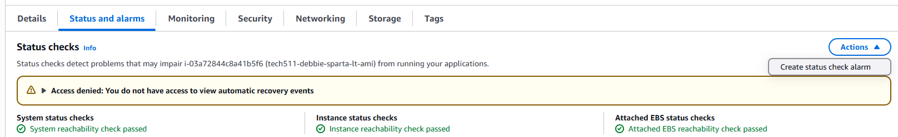
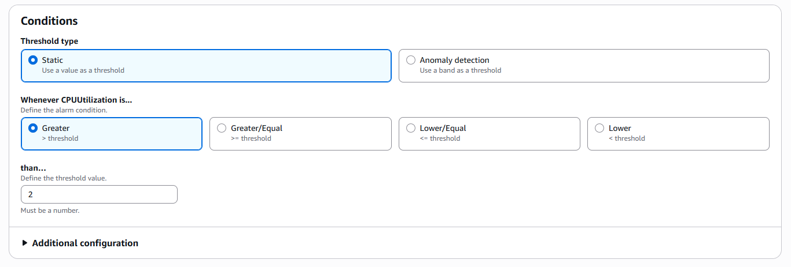
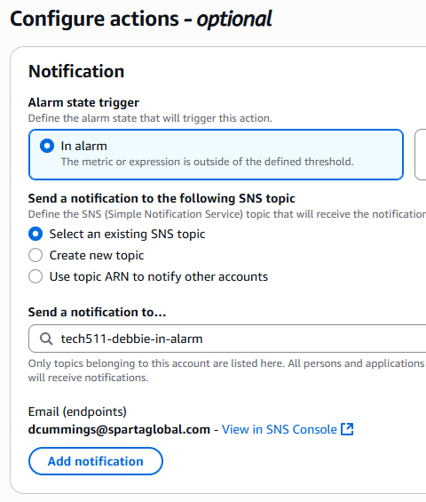
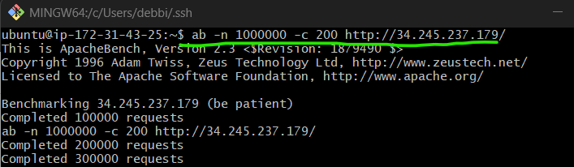
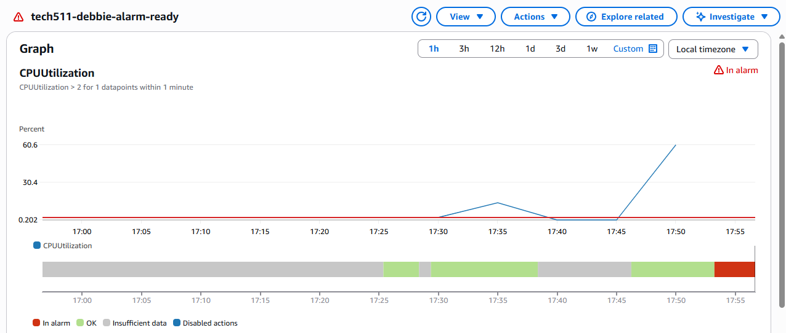
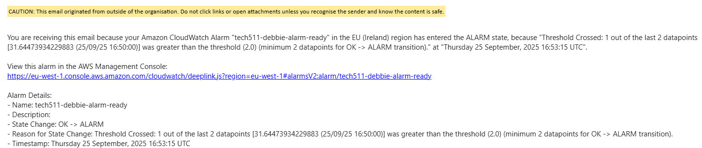
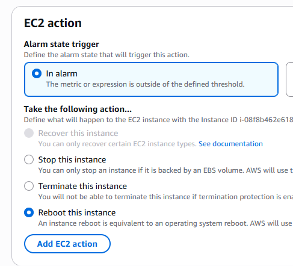

# Auto Scaling

- [Auto Scaling](#auto-scaling)
  - [Why use auto scaling](#why-use-auto-scaling)
    - [Vertical scaling](#vertical-scaling)
    - [Horizontal scaling](#horizontal-scaling)
  - [Planning the auto scaling group architecture to provide High Availability(HA) and Scalability(SC)](#planning-the-auto-scaling-group-architecture-to-provide-high-availabilityha-and-scalabilitysc)
  - [Create a launch template](#create-a-launch-template)
  - [Create a CPU Alarm](#create-a-cpu-alarm)
  - [Code-Along: Security Group](#code-along-security-group)
  - [Code-Along: Create a dashboard](#code-along-create-a-dashboard)

## Why use auto scaling
scale from worse to better

worse
- app vm with no monitoring --> app is running but no1 is monitoring, suddenly gets a lot of traffic, CPU load gets too high, the app will crash or fall over.
- app vm with cloud watch monitoring --> monitors the CPU load, gets put onto a dashboard, has to be continually monitored
- app vm with cloud watch monitoring with an alarm--> sends a notification via email or otherwise, issue can then be dealt with
- app vm with auto-scaling --> does everything for you, monitors and resolve any issues that arise

better


### Vertical scaling
This refers to scaling up or down

If working with an app virtual machine you can do this by:
- changing the size of the virtual machine
  - more/less RAM, processing power, faster/slower disk, faster/slower network access

If scaling up the machine will need to move the workload to a bigger machine and then remove the smaller virtual machine

### Horizontal scaling
Also refered to as scaling out(bigger)/in(smaller). You can create duplicates of the same machine

- this increases the availability of the app

## Planning the auto scaling group architecture to provide High Availability(HA) and Scalability(SC)
1. starting with your app virtual machine
2. created an image of the app (AMI)
   - tested before continuing 
3. launch template
   - will save everything you want about the configuration of the instance you are trying to create
   - the template will be used to create multiple virtual machines
4. auto scaling group
   - these create the virtual machines depending on the launch template
   - a scaling policy is created to determine when and how scaling should be done
     - desired minimum of 2 virtual machines so if one goes down there will always be at least 1 machine to keep the app running
     - maximum of 3 
     - CPU load is monitored across the virtual machines, could be set at 50% for example but is dependent on the app being created. It will use the average of the machines to determine when to create the new one.
       - a load balancer will ensure the traffic via HTTP is evenly distributed across the virtual machines.
6. regions (Ireland)
   - availability zones that host the virtual machines

## Create a launch template
1. log into AWS
2. select launch template

## Create a CPU Alarm 
*why create an alarm inc diagram*

install apache bench
```
sudo apt-get install apache2-utils
```
1. In your instance summary, scroll down and select status and alarms, and then select actions. 
   
2. From the drop down box, select create status check alarm


3. do step
   
4. set conditions to be met that will trigger the alarm


5. configure notifications so that an email notification is received once the alarm is triggered.


6. test alarm with apache bench


7. alarm triggered


8. email notifcation is received


9. stuck in triggered state

10. configurations changed so that the instance will reboot once the alarm is triggered.


11. ec2 instance updates after alarm is triggered


## Code-Along: Security Group

## Code-Along: Create a dashboard

